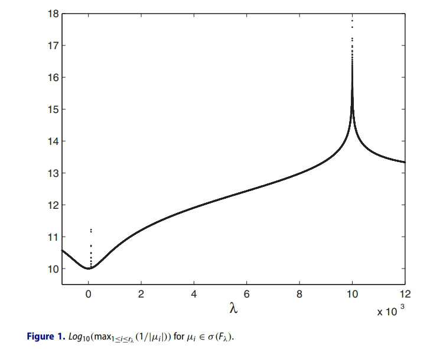
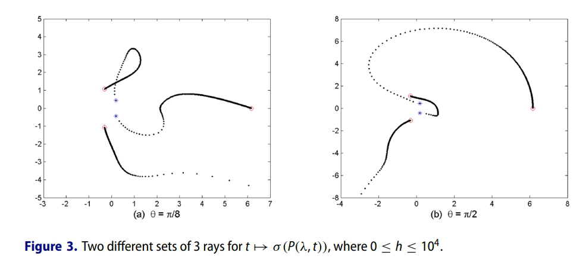
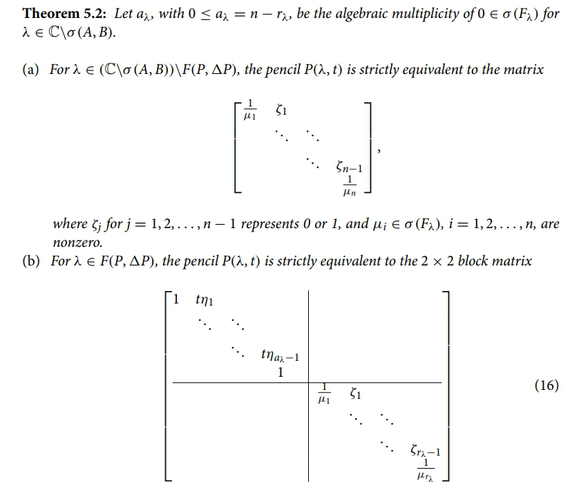

# Homotopic Deviation Theory for Regular Matrix Pencils  

This repository showcases the methods and results from our paper:  

**"Homotopic deviation theory for regular matrix pencils"**  
Morad Ahmadnasab, Panayiotis J. Psarrakos, *Linear and Multilinear Algebra*, 72 (2024) 1470-1496.  
https://doi.org/10.1080/03081087.2023.2182870

---

## 🔎 Overview  
We generalize the **homotopic deviation theory** from square complex matrices to **regular matrix pencils**  
\[
P(\lambda) = A - \lambda B.
\]  

Key aspects include:  
- Studying the **existence and analyticity of the resolvent** of deviated matrix pencils  
  \[
  P(\lambda,t) = (A+t\Delta A) - \lambda (B+t\Delta B),
  \]
  with $t \in \hat{\mathbb{C}}$.  
- Investigating the **limits of the resolvent and the spectrum** as $|t| \to \infty$.  
- Analyzing **special cases** when $t$ approaches eigenvalues of related matrix pairs.  
- Exploring how **Weierstrass structure** changes under different assumptions on the role of $\lambda$ and $t$.  
- Validating results with **numerical examples**.  

---

## ✨ Key Contributions  
- Extends homotopic deviation theory to **regular matrix pencils**.  
- Introduces refined notions of **frontier points, critical points, and limit points**.  
- Connects the deviation parameter $t$ with eigenvalues $\lambda(t)$ in the extended complex plane.  
- Characterization of the Weierstrass structure changes of deviated matrix pencils under two main cases.  

---
## 📊 Figures

  

  

  

---

## 📄 Reference  
If you use or refer to this work, please cite:  

M. Ahmadnasab, P. J. Psarrakos, *Linear and Multilinear Algebra*, 72 (2024) 1470-1496.  
https://doi.org/10.1080/03081087.2023.2182870  

